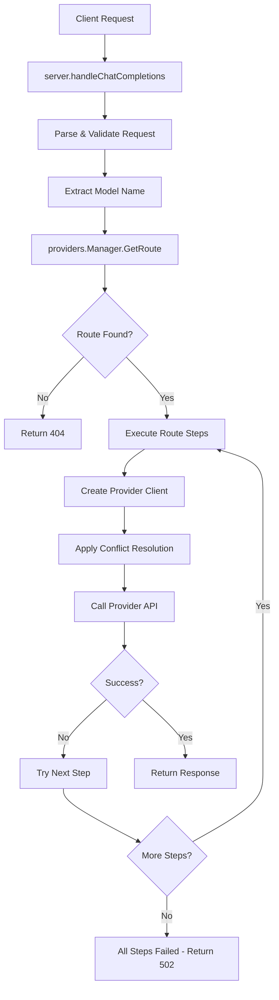

# Key Components & Data Flows

## Core Modules

### Configuration System (`config/`)
- **`types.go`**: Data structures for Config, Provider, Route, RouteStep
- **`config.go`**: YAML loading with env var substitution and validation
- **Key Functions**:
  - `LoadConfig()`: Loads and validates configuration
  - `GetTimeout()`: Resolves timeout from step or default
  - Route/provider validation with cross-reference checking

### Provider Management (`providers/`)
- **`manager.go`**: Route-based provider execution
- **`client.go`**: HTTP client with conflict resolution
- **Key Functions**:
  - `Manager.GetRoute()`: Exact model name matching
  - `Manager.ExecuteWithTracing()`: Sequential route step execution
  - `Client.applyConflictResolution()`: Request field manipulation

### Server Layer (`server/`)
- **`handlers.go`**: HTTP request/response handling
- **`server.go`**: Server setup and routing
- **Key Functions**:
  - `handleChatCompletions()`: Main request processing
  - Route lookup and error handling
  - Request/response logging with truncation

### Types (`types/`)
- **`types.go`**: OpenAI-compatible data structures
- **Key Features**:
  - Raw JSON preservation for passthrough
  - Selective field extraction for logging
  - Request/response truncation for security
  - **Multimodal content support**: Message.Content handles both string and array formats
  - Helper methods for content type detection and extraction

## Data Flow: Request Processing

## Integration Points

### Configuration Loading
- File lookup: `./config.yaml` → `/etc/ai-gateway/config.yaml`
- Environment variable expansion: `${VAR_NAME}` syntax
- Validation: Provider/route cross-references, timeout parsing

### Provider Communication
- HTTP POST to `/v1/chat/completions`
- Bearer token authentication
- Request field manipulation for conflict resolution
- Response passthrough (unchanged)

### Error Handling
- Route not found: 404 with model name
- Provider errors: 502 with detailed error messages
- Configuration errors: Fail fast on startup
- Logging: Structured JSON with field redaction

## Security Considerations

### API Key Management
- Environment variables for all sensitive data
- File permissions: 600 (owner read/write only)
- Logging redaction: Automatic API key removal
- Service user: Non-root `ai-gateway` user

### Request Processing
- Input validation: Basic structure checking
- Content truncation: Message content limited in logs
- TLS requirement: External TLS termination expected
- Timeout enforcement: Per-route step configuration

## Deployment Integration

### Systemd Service
- Service file: `ai-gateway.service`
- User management: Dedicated service account
- Log management: journalctl integration
- Auto-restart: Service failure recovery

### SSH Deployment
- Script: `install.sh deploy`
- Remote operations: Binary copy, config deployment
- Service management: Stop/start/restart cycle
- Rollback capability: Previous version preservation