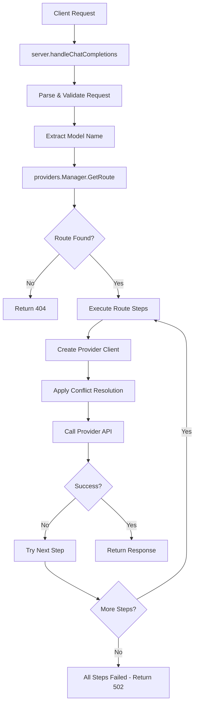

# Key Components & Data Flows

## Core Modules

### Configuration System (`config/`)
- **`types.go`**: Data structures for Config, Provider, Route, RouteStep (`default_route_timeout`, `route_timeout`, `step_timeout`)
- **`config.go`**: YAML loading with env var substitution and validation
- **Key Functions**:
  - `LoadConfig()`: Loads and validates configuration
  - `ValidateTimeoutSettings()`: Reusable timeout validation for both file-loaded and programmatic configs
  - Strict decode (`KnownFields(true)`): Unknown YAML keys fail fast during config load
  - `GetStepTimeout()`: Resolves per-step timeout (`step_timeout` -> 30s fallback)
  - `GetRouteTimeout()`: Resolves route budget (`route_timeout` -> `default_route_timeout` -> derived/fallback)
  - `MaxSequentialRouteDuration()`: Computes worst-case per-request route duration by summing step timeouts per route and taking max route sum
  - `EffectiveHTTPServerTimeouts()`: Derives server read/write timeout from effective route budget with a 30s floor (no upper clamp)
  - Route/provider validation with cross-reference checking
- **Ops**: Task **Verify provider model lists** runs `go run ./cmd/check-models` from `app/` (see `.vscode/tasks.json`) to confirm each provider’s upstream `/models` endpoint.

### Provider Management (`providers/`)
- **`manager.go`**: Route-based provider execution
- **`client.go`**: HTTP client with conflict resolution
- **Key Functions**:
  - `Manager.GetRoute()`: Exact model name matching
  - `Manager.ExecuteWithTracing()`: Sequential route step execution with route-scoped timeout context
  - `NewManager(cfg, ...)`: Uses config-level timeout policy (`default_route_timeout`, `route_timeout`, `step_timeout`)
  - `Client.applyConflictResolution()`: Request field manipulation

### Server Layer (`server/`)
- **`handlers.go`**: HTTP request/response handling
- **`server.go`**: Server setup and routing
- **Key Functions**:
  - `NewServer()`: Uses config-derived effective read/write timeout instead of fixed 30s
  - `handleChatCompletions()`: Main request processing
  - `handleUpstreamModelsCheck()`: `GET /v1/diagnostics/upstream-models` — unauthenticated; validates each provider’s upstream models API (same as CLI check)
  - Route lookup and error handling
  - Request/response logging with truncation

### Types (`types/`)
- **`types.go`**: OpenAI-compatible data structures
- **Key Features**:
  - Raw JSON preservation for passthrough
  - Selective field extraction for logging
  - Request/response truncation for security
  - **Multimodal content support**: Message.Content handles both string and array formats
  - Helper methods for content type detection and extraction

### Telemetry (`telemetry/`)
- **Purpose**: Initializes the **OTLP/HTTP exporter** that sends traces and logger events to whichever collector `OTEL_*` or `OTLP_*` env vars point to.
- **Key Components**:
  - **`newTraceExporter()`**: Supports **automatic Grafana Cloud authentication** by parsing `glc_` tokens.
  - **`normalizeEndpoint()`**: Intelligent URL and signal path handling.
  - **`RecordLog()`**: Reusable helper that replays logger entries into OTLP.
  - **Standard Compliance**: Supports both standard `OTEL_` and legacy `OTLP_` environment variables.

## Data Flow: Request Processing

```mermaid
graph TD
    A[Client Request] --> B[server.handleChatCompletions]
    B --> C[Parse & Validate Request]
    C --> D[Extract Model Name]
    D --> E[providers.Manager.GetRoute]
    E --> F{Route Found?}
    F -->|No| G[Return 404]
    F -->|Yes| H[Execute Route Steps]
    H --> I[Create Provider Client]
    I --> J[Apply Conflict Resolution]
    J --> K[Call Provider API]
    K --> L{Success?}
    L -->|No| M[Try Next Step]
    L -->|Yes| N[Return Response]
    M --> O{More Steps?}
    O -->|Yes| H
    O -->|No| P[All Steps Failed - Return 502]
```

## Integration Points

### Configuration Loading
- File lookup: `./config.yaml` → `/etc/ai-gateway/config.yaml`
- Environment variable expansion: `${VAR_NAME}` syntax with missing-var fail fast
- Validation: Provider/route cross-references, strict known-field schema, timeout parsing with `> 0` enforcement

### Provider Communication
- HTTP POST to `/v1/chat/completions`
- Bearer token authentication
- Request field manipulation for conflict resolution
- Response passthrough (unchanged)

### Error Handling
- Route not found: 404 with model name
- Provider errors: 502 with detailed error messages
- Configuration errors: Fail fast on startup
- Logging: Structured JSON with field redaction

## Security Considerations

### API Key Management
- Environment variables for all sensitive data
- File permissions: 600 (owner read/write only)
- Logging redaction: Automatic API key removal
- Service user: Non-root `ai-gateway` user

### Request Processing
- Input validation: Basic structure checking
- Content truncation: Message content limited in logs
- TLS requirement: External TLS termination expected
- Timeout enforcement: Per-route step configuration

## Deployment Integration

### Systemd Service
- Service file: `ai-gateway.service`
- User management: Dedicated service account
- Log management: journalctl integration
- Auto-restart: Service failure recovery

### SSH Deployment (systemd)
- Script: `ops.sh deploy`
- Remote operations: Binary copy, config deployment
- Service management: Stop/start/restart cycle

### Docker Deployment
- **CI/CD:** `.github/workflows/deploy.yml` — build/push `ghcr.io/leshchenko1979/ai-gateway`, SSH deploy `docker compose pull && up -d` on VDS (`/root/services/ai-gateway`). Secrets: `SSH_*`, optional `GHCR_PULL_*` for private registry.
- **Runtime:** Compose uses pulled `image:` + bind-mount `./config.yaml`; Dockerfile bakes `config.yaml.example` only.
- **Sync:** `scripts/sync-config-to-vds.sh` pushes `docker-compose.yml`, `config.yaml`, filtered `.env`; task **Sync config and env to VDS** in `.vscode/tasks.json`.
- **CLI deploy:** `ops.sh deploy-docker` delegates to `scripts/sync-config-to-vds.sh` (compose pull, bind-mounted `config.yaml`, same as CI)
- Files: `Dockerfile`, `docker-compose.yml`, `.dockerignore`
- Traefik: Host rule uses `DOMAIN` from `.env`